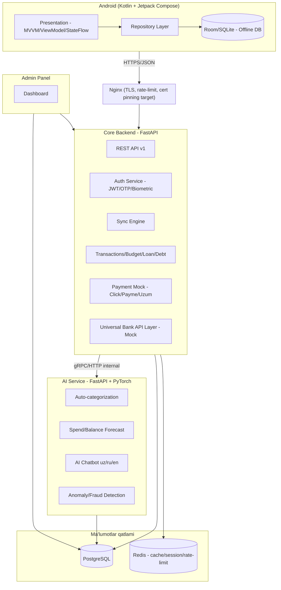

# SMART MOLIYA — Arxitektura (1-bosqich)

## 1. Umumiy ko'rinish

SMART MOLIYA — offline-first Android FinTech ilova bo'lib, uchta mustaqil xizmatga bo'linadi:

| Xizmat | Til/Freymvork | Vazifa |
|---|---|---|
| **Mobile App** | Kotlin + Jetpack Compose | Native Android Studio loyihasi (Gradle), Android 10+ klient, offline Room/SQLite, online bo'lganda sync |
| **Core Backend** | Python 3.12 + FastAPI | Auth, tranzaksiyalar, byudjet, qarz/kredit, sync, payment mock |
| **AI Service** | Python + PyTorch | Kategoriyalash, bashorat, chatbot, anomaliya aniqlash |
| **Admin Panel** | FastAPI + server-rendered dashboard | Fraud monitoring, foydalanuvchi boshqaruvi, analitika |

Barcha backend xizmatlar bitta monorepo ichida, lekin mustaqil deploy qilinadigan Docker konteynerlar sifatida yashaydi (mikroservis chegarasi AI Service uchun alohida — og'ir PyTorch modeli asosiy API ni bloklamasligi kerak).

## 2. Yuqori darajadagi arxitektura



## 3. Mobile — Native Android, Clean Architecture qatlamlari

```
presentation   →   domain    →    data
 (Compose UI,       (entities,      (repository impl,
  ViewModel,        usecases,       Room DAO,
  StateFlow/UiState) repo interfaces) Retrofit datasource)
```

- **Loyiha turi**: toza Gradle-based Android Studio loyihasi (`android/` papka Android Studio root'i — `File > Open` orqali to'g'ridan-to'g'ri ochiladi, qo'shimcha SDK/plagin shart emas).
- **Til/UI**: Kotlin + Jetpack Compose, Material Design 3 (dynamic color, dark/light tema).
- **Arxitektura**: MVVM (ViewModel + StateFlow/UiState), Clean Architecture (presentation/domain/data), Repository Pattern.
- **SOLID/DRY/KISS**: har feature moduli o'z ichida `presentation/domain/data` ga bo'linadi (feature-based + layered), Gradle multi-module (`:core:*`, `:feature:*`) kelgusi bosqichlarda.
- **Dependency Injection**: Hilt (`@HiltAndroidApp`, `@AndroidEntryPoint`, `@Module`/`@InstallIn`).
- **Offline DB**: Room (SQLite ustida), `SQLCipher` bilan shifrlangan baza.
- **Tarmoq**: Retrofit + OkHttp (interceptors: auth token, cert pinning, logging faqat debug build'da).
- **Async**: Kotlin Coroutines + Flow.
- **Navigatsiya**: Navigation Compose.
- **Offline-first qoida**: har yozuv avval Room'ga yoziladi (`syncStatus = PENDING`), `WorkManager` orqali fon jarayonida `SyncEngine` serverga jo'natadi va konflikt bo'lsa `updatedAt`(last-write-wins) + `version` ustuni orqali hal qiladi.

## 4. Backend — qatlamlar

```
api/          # FastAPI routerlar (faqat HTTP <-> DTO)
services/       # Biznes logika (framework'dan mustaqil)
repositories/     # DB access (SQLAlchemy async)
schemas/        # Pydantic DTO
models/        # SQLAlchemy ORM modellari
core/         # config, security, dependency-injection, middleware
```

Repository Pattern har jadval uchun interfeys + implementatsiya bilan, servis qatlami repository interfeysiga bog'lanadi (testlarda mock qilish oson bo'lishi uchun).

## 5. Xavfsizlik arxitektura qarorlari

- Transport: TLS 1.3, mobil tomonda Certificate Pinning.
- Auth: JWT (access 15 daq, refresh 30 kun, rotatsiya bilan) + OTP (SMS) + biometrik/PIN faqat mahalliy ekran qulfi sifatida (server bunga ishonmaydi).
- Ma'lumot: SQLite mobil tomonda SQLCipher bilan shifrlangan, serverda maxfiy maydonlar (karta raqami oxirgi 4 ta xonasidan boshqasi) saqlanmaydi — PCI doirasidan tashqarida qolish uchun mock to'lovlar ishlatiladi.
- Device Binding: har refresh token `device_id` ga bog'lanadi, root-detection natijasi login paytida yuboriladi va shubhali holatda funksionallik cheklanadi.

## 6. Bank/Payment integratsiya arxitekturasi

`BankLayer` — umumiy interfeys (`BankProvider` abstract class), har bank uchun alohida adapter (`AsakaAdapter`, `NBUAdapter`, ...). Hozircha barchasi `MockBankProvider` orqali ishlaydi, real integratsiya keyinchalik adapterni almashtirish orqali qo'shiladi (Strategy pattern → Open/Closed Principle).

## 7. AI Service arxitekturasi

Alohida FastAPI xizmat, Core Backend bilan ichki REST orqali gaplashadi (kelajakda gRPC'ga o'tish mumkin). Modellar:
- **Classifier**: matn (chek/tranzaksiya tavsifi) → kategoriya (fine-tuned kichik transformer yoki klassik ML boshlang'ich versiya uchun).
- **Forecast**: vaqt qatorlari modeli (LSTM/statistik gibrid) — kelasi oy xarajat va "pul tugash sanasi" bashorati.
- **Chatbot**: LLM-based (uz/ru/en), RAG orqali foydalanuvchi tranzaksiya kontekstidan foydalanadi.
- **Anomaly**: statistik + isolation forest — g'ayrioddiy xarajat/firibgarlik signali.

## 8. Ma'lumotlar sinxronizatsiyasi

Offline mobil ↔ online server: `/sync/pull` (server'dan o'zgargan yozuvlar) va `/sync/push` (mobil'dan pending yozuvlar), har ikkisi `since_version` cursor bilan incremental. Konflikt siyosati: last-write-wins + audit log.

## 9. DevOps

Docker Compose: `mobile-build (CI only)`, `core-backend`, `ai-service`, `admin-panel`, `postgres`, `redis`, `nginx`. GitHub Actions: lint → test → build → (staging) deploy.

## 10. Keyingi bosqich

2-bosqich — **Database**: to'liq ER diagram, SQLAlchemy modellari, migratsiyalar (Alembic), SQLite offline sxema.
